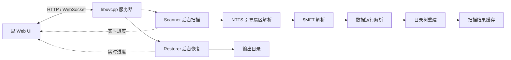

<div align="center">

# 🛠️ fsrec

**从零实现的 NTFS 数据恢复工具**

通过 Windows 原始磁盘读取接口解析 NTFS 文件系统、重建目录树，支持扫描、搜索与**选择性恢复**已删除或误格式化后仍存留的文件。

[](LICENSE)
[](https://github.com/Antruly/fsrec/releases)
[](#)
[](#)

[功能特性](#-功能特性) · [快速开始](#-快速开始) · [工作原理](#-工作原理) · [构建](#-构建) · [API](#-api-概览) · [安全](#-安全与注意事项)

</div>

---

## 📖 简介

**fsrec** 是一款面向 Windows 的 NTFS 数据恢复工具。它不依赖任何第三方恢复引擎，而是直接从 NTFS
底层数据结构出发——解析引导扇区（BPB）、主文件表（`$MFT`）与数据运行（Data Run），在内存中重建
完整的目录树。你可以像浏览普通文件一样浏览那些已被删除、被清空回收站，甚至在分区被误格式化后
仍残留在磁盘上的文件，并**按原目录结构**把它们恢复到另一块磁盘。

| 维度 | 说明 |
|------|------|
| 语言 / 运行时 | C++17（MSVC，Windows x64） |
| 网络层 | [libuvcpp](https://github.com/Antruly/libuvcpp)（HTTP / WebSocket / 静态文件，仅引用） |
| JSON | [nlohmann/json](https://github.com/nlohmann/json)（单头文件，已内置） |
| 前端 | 单文件原生 HTML/CSS/JS（`frontend/dist/index.html`，零构建步骤） |

---

## ✨ 功能特性

- 🔍 **磁盘枚举** — 列出物理磁盘与盘符，自动识别并锁定系统盘（磁盘 0，禁止选择）
- 🧭 **引导扇区解析** — 读取 BPB：字节/扇区、扇区/簇、`$MFT` 起始 LCN、记录大小等
- 📚 **`$MFT` 解析** — 遍历文件记录，USA 修复，提取 `$STANDARD_INFORMATION` / `$FILE_NAME` / `$DATA`
- 🧩 **数据运行解析** — resident / non-resident 属性，含稀疏簇处理
- 🌲 **目录树重建** — 依据父引用与文件名（含 `$MFT` 编号兜底）构建完整树
- 🗂️ **分区级扫描** — `raw_scan_all` 遍历整盘，定位每个 NTFS 分区并分别缓存
- 🔎 **搜索过滤** — 前端按名称 / 类型快速筛选
- ♻️ **选择性恢复** — 保留原目录结构写入输出目录，同名文件自动改名，支持**暂停 / 继续 / 停止**
- 📡 **实时进度** — WebSocket 推送总体进度 + 当前文件 + 每文件字节进度；刷新页面后自动恢复进行中的任务
- 📊 **磁盘监控** — 实时读取速度（全局 + 单盘）、点击磁盘展开**任务管理器风格动态折线图**、磁盘**热插拔**自动刷新并提示任务中断
- 🛡️ **安全与空间** — 源盘锁定（目录选择器禁用源盘）、空间预估与不足警告

---

## 🚀 快速开始

### 直接下载（推荐）

从 [Releases](https://github.com/Antruly/fsrec/releases) 下载 `fsrec_Setup_1.0.3.exe`，
双击安装（全中文向导）。安装完成后双击桌面 / 开始菜单的 **fsrec** 图标：

1. 自动触发 UAC 提权（`requireAdministrator` 清单）
2. 服务在后台启动，并自动打开浏览器访问 Web UI
3. 选择源磁盘 → 扫描 → 勾选文件 → 恢复到另一块磁盘

### 从源码构建

前置条件：Windows、Visual Studio 2022（MSVC，需匹配预编译的 libuvcpp 二进制）、CMake ≥ 3.20。

```powershell
git clone https://github.com/Antruly/fsrec.git
cd fsrec
cmake -S . -B build -A x64
cmake --build build --config Release
```

产物 `build\Release\recovery_server.exe`，运行时依赖同目录下的 `uvcpp.dll`、`uv.dll`、
`llhttp.dll`、`libssl-3-x64.dll`、`libcrypto-3-x64.dll`。

> 📌 libuvcpp 为独立仓库：[Antruly/libuvcpp](https://github.com/Antruly/libuvcpp)，fsrec 仅引用其
> 构建产物，路径在 `CMakeLists.txt` 的 `LIBUVCPP_ROOT`。

### 命令行运行

```powershell
recovery_server.exe                # 监听 0.0.0.0:8080，自动打开浏览器
recovery_server.exe --port 8090    # 指定端口
recovery_server.exe --no-browser   # 不自动打开浏览器
```

健康检查：

```powershell
curl http://localhost:8080/ping
# → {"status":"ok","name":"fsrec","version":"1.0.3"}
```

---

## 🧠 工作原理



1. **读取**：以 `CreateFile(\\.\PhysicalDriveN, GENERIC_READ)` 只读打开源盘，绝不在源盘写入。
2. **定位**：解析引导扇区 BPB，找到 `$MFT` 起始位置与记录大小。
3. **解析**：遍历 `$MFT` 文件记录，修复 USA，提取属性与数据运行，重建目录树。
4. **恢复**：按用户勾选的路径，将文件内容（含已删除但仍残留的数据簇）原样写入另一块磁盘。

---

## 📁 目录结构

```
fsrec/
├── CMakeLists.txt
├── src/
│   ├── main.cpp                 # 入口：管理员检测 + 参数解析 + 启动服务 + 自动开浏览器
│   ├── include/                 # types.h / util.h / util.cpp / version.h
│   ├── ntfs/                    # disk_reader / boot_parser / data_run / mft_parser / tree_builder
│   ├── recovery/                # scanner（后台扫描）/ restorer（后台恢复）
│   └── http/server.*            # 路由 + WebSocket 推送中心
├── resources/
│   ├── icon.png                 # 图标母版（make_icon.ps1 生成 fsrec.ico）
│   ├── fsrec.ico                # 多尺寸应用图标
│   └── fsrec.rc                 # 版本信息 + 图标资源（提权清单由 /MANIFESTUAC 链接器内嵌）
├── frontend/
│   └── dist/index.html          # 线上前端（单文件；frontend/src 为废弃的 Vue 残留）
├── docs/
│   ├── 使用说明.md               # 用户手册（操作流程 + 注意事项 + FAQ）
│   └── 免责声明.md
├── packaging/
│   ├── fsrec.iss                # Inno Setup 安装脚本（全中文）
│   └── languages/ChineseSimplified.isl
├── scripts/
│   ├── make_icon.ps1            # icon.png → fsrec.ico
│   └── build_release.ps1        # 一键构建 + 打包安装程序
├── start.bat / stop.bat         # 启动 / 停止脚本
└── LICENSE / README.md
```

---

## 📦 打包发布（Inno Setup）

前置条件：已安装 [Inno Setup 6](https://jrsoftware.org/isdl.php)；脚本会首次自动下载简体中文语言文件。

```powershell
powershell -ExecutionPolicy Bypass -File scripts\build_release.ps1
```

产物输出到 `release\fsrec_Setup_1.0.3.exe`（全中文安装向导，安装后生成开始菜单 / 桌面快捷方式，
双击 exe 自动提权并打开浏览器）。

---

## 🔌 API 概览

| 方法 | 路径 | 说明 |
|------|------|------|
| GET  | `/ping` | 健康检查（含 `name` / `version`） |
| GET  | `/api/physical_disks` | 物理磁盘列表（`disk_number` / `model` / `size`） |
| POST | `/api/raw_scan_all` | `{disk_number}` 遍历整盘、定位所有分区 → 各分区独立 task |
| GET  | `/api/scans` | 已完成的扫描（含持久化缓存） |
| GET  | `/api/active` | 进行中的扫描 / 恢复任务（刷新页面后恢复状态用） |
| GET  | `/api/scan/{id}/status` | 扫描进度 |
| GET  | `/api/scan/{id}/results` | 目录树（根节点 `/`） |
| POST | `/api/scan/{id}/pause\|resume\|stop` | 暂停 / 继续 / 停止扫描 |
| POST | `/api/recover` | `{task_id, selected_paths[], output_dir}` → `{job_id}` |
| GET  | `/api/recover/{id}/status` | 恢复进度（含 `current_file` / `current_bytes` / `current_size`） |
| POST | `/api/recover/{id}/pause\|resume\|stop` | 暂停 / 继续 / 停止 |
| GET  | `/api/fs/drives` | 盘符 + `physical_disks[]` 映射 + 可用空间 |
| GET  | `/api/fs/list?path=` | 目录列表（选择器用） |
| POST | `/api/fs/mkdir` | `{path, name}` 新建目录 |
| GET  | `/api/fs/space?path=` | 目标卷 free / total |
| WS   | `/ws` | WebSocket 扫描 / 恢复进度实时推送 |

---

## 🛡️ 安全与注意事项

- 源盘通过 `CreateFile(GENERIC_READ)` **只读**打开，绝不写入源盘。
- 恢复输出目录后端会校验并**拒绝与源盘 / 系统盘相同的磁盘**。
- 已删除文件的数据区可能已被覆写，不可恢复项会标注。
- 同名文件自动追加 `_1`、`_2`… 后缀，不覆盖。
- 请勿在存有重要数据的生产机上随意测试；详见 `docs/使用说明.md` 与 `docs/免责声明.md`。

---

## 🙏 致谢

- [Antruly/libuvcpp](https://github.com/Antruly/libuvcpp) — HTTP / WebSocket / 静态文件服务器框架
- [nlohmann/json](https://github.com/nlohmann/json) — 现代 C++ JSON 库

## 📄 许可证

[MIT](LICENSE) © 2026 Antruly
